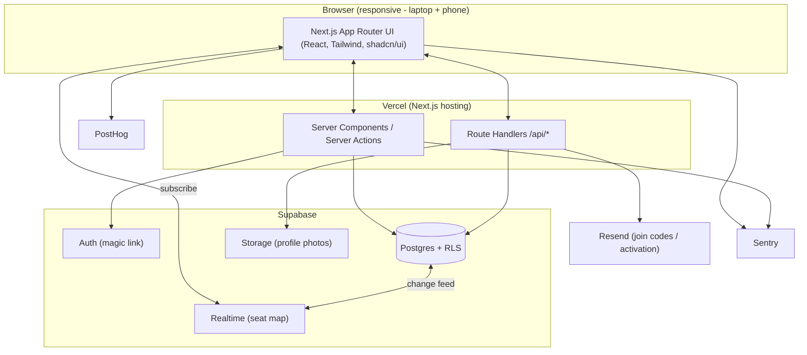

# PRD — ClassAct

> Technical blueprint for the ClassAct MVP. Consumed directly by the coding agent.
> Reads alongside `docs/product-vision.md` (strategy/brand) and `docs/design.md` (visual tokens — generate via the Design System skill if absent).

## 1. Overview

### Product Summary

**ClassAct** — a lightweight in-person LMS that turns a face-to-face lecture hall into a connected, engaged classroom. The MVP is the classroom-community core: professors set up a course and a seat map; students onboard with a photo profile; and in class, students check in by tapping their seat and verifying the peers around them, then play name games while the room fills. It is a responsive web app, laptop-primary with full phone support for in-room check-in.

### Objective

This PRD covers the **MVP scope only** as defined in `docs/product-vision.md § MVP Definition` — faculty course + seat-map setup, student magic-link onboarding with photo profiles, CSV roster import, live seat-map check-in with peer verification, name games, and a basic ClassAct Metrics dashboard. Out-of-scope features (lecture dashboard, AI think-pair-share, peer grading, shout-outs, jobs marketplace, deep Canvas API, payments) are enumerated in § 13 and must not be built in this cycle.

### Market Differentiation

The implementation must deliver two things competitors can't: (1) **fraud-proof attendance** — a check-in that is physically bound to the room via peer verification, so it cannot be completed remotely; and (2) **community as a byproduct** — the same check-in that records attendance forces a real introduction, and name games make the room non-anonymous within weeks. Technically this means the seat map and verification flow must be realtime, reliable under full-room concurrent load, and fast (sub-minute end to end).

### Magic Moment

*A student walks into a hall of strangers, taps their seat, confirms the four people around them, plays a 30-second name game, and by week three the room isn't anonymous.* For this to work: the student is already onboarded with photos before class; the seat map loads instantly and updates live as peers check in; verifying neighbors is one tap each; the name game starts in under two seconds. What must be fast: seat-map load and check-in write. What must be seamless: neighbor verification. What must work perfectly: no lost or double check-ins under concurrent load.

### Success Criteria

- Time from opening the app to completed, verified check-in **< 60 seconds** for a returning student.
- Seat map reflects a peer's check-in **< 2 seconds** (realtime).
- **40+ concurrent** check-ins in one session with zero lost writes or duplicate seat assignments.
- All **P0** functional requirements implemented and manually verified.
- Faculty course + seat-map setup completable in **< 5 minutes**.
- Passes `next build` and `tsc --noEmit` with no errors; core flows covered by tests.

## 2. Technical Architecture

### Architecture Overview



### Chosen Stack

| Layer | Choice | Rationale |
|---|---|---|
| Frontend | Next.js (App Router) + React + TypeScript + Tailwind CSS + shadcn/ui | Most AI-legible web stack; one responsive codebase for laptop + phone. |
| Backend | Next.js server actions + route handlers | No separate server; frontend and backend ship as one app. |
| Database | Supabase Postgres | Relational data + RLS for FERPA-grade access control. |
| Auth | Supabase Auth (magic link / OTP email) | Low-friction "click to activate"; consolidated with DB/storage. |
| Realtime | Supabase Realtime | Live seat map without custom websocket infra. |
| Storage | Supabase Storage | Three profile photos per student, access-controlled. |
| Analytics | PostHog | Funnel + magic-moment instrumentation; generous free tier. |
| Email | Resend | Join-code / activation emails central to onboarding. |
| Error tracking | Sentry | Catch client + server errors under full-room load. |

*(Payments intentionally omitted — MVP is free; see § 10.)*

### Stack Integration Guide

**Setup order:**
1. Scaffold Next.js (App Router, TypeScript, Tailwind, ESLint, `src/` dir, `@/*` alias).
2. Init shadcn/ui; add base components (button, card, input, dialog, form, toast/sonner, avatar, badge, table, tabs, skeleton).
3. Create Supabase project (already created by founder as "Class Act") → capture URL + anon key + service-role key.
4. Wire Supabase SSR clients (`@supabase/ssr`): a browser client, a server client (cookies), and a service-role admin client for privileged server-only ops (roster import, email).
5. Apply database migrations (§ 3) via the Supabase SQL editor or `supabase db push`.
6. Configure Storage bucket `profile-photos` (private) + RLS-aligned access policies.
7. Wire Resend (server-only), PostHog (client + server), Sentry (client + server) last.

**Known patterns / gotchas:**
- Use `@supabase/ssr` (not the deprecated `auth-helpers`) with `createServerClient`/`createBrowserClient` and Next.js `cookies()`.
- **Never** expose the service-role key to the client — use it only in server actions / route handlers for roster import and admin reads.
- Realtime requires the table to be added to the `supabase_realtime` publication and RLS to permit the subscribing user to `SELECT` the rows.
- Magic-link redirects must list every environment URL in Supabase Auth → URL Configuration (localhost + Vercel preview + prod).
- Photo uploads go through a signed-URL or server action to keep the bucket private; store only the path in Postgres.

**Required environment variables:**
```
NEXT_PUBLIC_SUPABASE_URL=
NEXT_PUBLIC_SUPABASE_ANON_KEY=
SUPABASE_SERVICE_ROLE_KEY=        # server only
NEXT_PUBLIC_SITE_URL=             # e.g. https://classact.college
RESEND_API_KEY=
EMAIL_FROM="ClassAct <noreply@classact.college>"
NEXT_PUBLIC_POSTHOG_KEY=
NEXT_PUBLIC_POSTHOG_HOST=https://us.i.posthog.com
NEXT_PUBLIC_SENTRY_DSN=
SENTRY_AUTH_TOKEN=                # build-time source maps (optional)
```

### Repository Structure

```
classact/
├── src/
│   ├── app/
│   │   ├── (marketing)/                # public landing
│   │   │   └── page.tsx
│   │   ├── (auth)/
│   │   │   ├── login/page.tsx
│   │   │   └── auth/callback/route.ts  # magic-link exchange
│   │   ├── join/[code]/page.tsx        # student join by code
│   │   ├── (app)/
│   │   │   ├── dashboard/page.tsx       # role-aware home
│   │   │   ├── onboarding/page.tsx      # student profile + photos
│   │   │   ├── course/[courseId]/
│   │   │   │   ├── page.tsx             # course home (role-aware)
│   │   │   │   ├── setup/page.tsx       # professor: seatmap + roster + icebreakers
│   │   │   │   ├── checkin/page.tsx     # student: live seat map check-in
│   │   │   │   ├── games/page.tsx       # name games
│   │   │   │   └── metrics/page.tsx     # ClassAct metrics
│   │   │   └── layout.tsx               # authed shell
│   │   ├── api/
│   │   │   ├── roster/import/route.ts
│   │   │   ├── invites/send/route.ts
│   │   │   └── health/route.ts
│   │   ├── layout.tsx
│   │   └── globals.css
│   ├── components/
│   │   ├── ui/                          # shadcn primitives
│   │   └── features/
│   │       ├── seatmap/                 # SeatMapBuilder, SeatMapLive, Seat
│   │       ├── profile/                 # PhotoUploader, IcebreakerForm
│   │       ├── games/                   # MemoryTiles, FlashCards
│   │       └── metrics/                 # MetricCard, NetworkingScore
│   ├── lib/
│   │   ├── supabase/                    # browser.ts, server.ts, admin.ts
│   │   ├── auth.ts                      # session + role helpers
│   │   ├── validators.ts                # zod schemas
│   │   ├── email.ts                     # Resend wrappers
│   │   ├── analytics.ts                 # PostHog
│   │   └── utils.ts
│   ├── server/
│   │   └── actions/                     # server actions per feature
│   └── types/
│       └── db.ts                        # generated Supabase types
├── supabase/
│   └── migrations/                      # SQL migrations (§ 3)
├── public/
├── .env.example
├── HANDOFF.md
└── ...
```

### Infrastructure & Deployment

- **Deploy:** Vercel, connected to the "Class Act" GitHub repo. Auto-deploy `main` → production, PRs → preview URLs.
- **Database:** Supabase hosted (founder's "Class Act" project). Migrations live in `supabase/migrations/` and are applied via the Supabase SQL editor or CLI (`supabase db push`).
- **Env vars:** set the § 2 variables in Vercel (Production + Preview) and in `.env.local` for dev. Supabase Auth redirect URLs must include localhost, the Vercel preview wildcard, and prod.
- **CI:** GitHub Actions running `tsc --noEmit`, `next lint`, `next build`, and tests on every PR (optional but recommended).

### Security Considerations

- **Auth:** magic-link only; no passwords. Sessions via Supabase SSR cookies (httpOnly). Tokens refreshed by the SSR client.
- **Authorization:** Postgres **RLS on every table**. Students can read only their own PII and course-scoped public profile fields; professors can read only their own courses and enrolled students; no cross-course leakage. All mutations pass RLS or run through vetted server actions using the service-role key with explicit ownership checks.
- **PII / FERPA:** profile photos and roster data are personal data. Storage bucket is private; access via signed URLs scoped to course members. Roster import runs server-side only. Students can delete their data (photos + answers) — data-ownership is a product value.
- **Input validation:** all inputs validated with **zod** at the server-action / route boundary. CSV parsing is size- and type-limited.
- **Rate limiting:** invite-send and roster-import endpoints rate-limited per professor.
- **Error tracking:** Sentry configured to **scrub PII and secrets** from events and breadcrumbs (no emails, tokens, or photo URLs in payloads); use `beforeSend` to redact.

### Cost Estimate (first 6 months, < 1000 users)

- **Supabase:** Free tier (up to 500MB DB, 1GB storage, 50k MAU) covers a single-class pilot; **$0**. Pro ($25/mo) only if storage/bandwidth grows.
- **Vercel:** Hobby/Free for the pilot; **$0** (Pro $20/mo if custom domain + team needed).
- **Resend:** Free tier 3,000 emails/mo, 100/day — ample for one class; **$0**.
- **PostHog:** Free tier 1M events/mo; **$0**.
- **Sentry:** Free tier (5k errors/mo); **$0**.
- **Domain:** `classact.college` already owned.
- **Total: ~$0/mo** during the pilot; ~$45–65/mo only if Supabase + Vercel Pro become necessary at scale.

## 3. Data Model

Postgres via Supabase. All tables have RLS enabled. Timestamps are `timestamptz DEFAULT now()`. IDs are `uuid DEFAULT gen_random_uuid()` unless noted.

### Entity Definitions

```sql
-- profiles: 1:1 with auth.users
CREATE TABLE profiles (
  id UUID PRIMARY KEY REFERENCES auth.users(id) ON DELETE CASCADE,
  role TEXT NOT NULL DEFAULT 'student' CHECK (role IN ('student','professor')),
  full_name TEXT,
  onboarding_complete BOOLEAN NOT NULL DEFAULT false,
  created_at TIMESTAMPTZ NOT NULL DEFAULT now()
);

-- courses
CREATE TABLE courses (
  id UUID PRIMARY KEY DEFAULT gen_random_uuid(),
  professor_id UUID NOT NULL REFERENCES profiles(id) ON DELETE CASCADE,
  name TEXT NOT NULL,
  term TEXT,                                   -- e.g. 'Fall 2026'
  join_code TEXT NOT NULL UNIQUE,              -- short, human-typable (e.g. 'MKT-7Q2X')
  icebreaker_fields JSONB NOT NULL DEFAULT '[]'::jsonb,  -- array of enabled field keys
  created_at TIMESTAMPTZ NOT NULL DEFAULT now()
);

-- seats: the room layout for a course
CREATE TABLE seats (
  id UUID PRIMARY KEY DEFAULT gen_random_uuid(),
  course_id UUID NOT NULL REFERENCES courses(id) ON DELETE CASCADE,
  label TEXT NOT NULL,                          -- e.g. '4C'
  row_index INT NOT NULL,
  col_index INT NOT NULL,
  UNIQUE (course_id, label),
  UNIQUE (course_id, row_index, col_index)
);

-- enrollments: roster rows; profile_id null until the student activates
CREATE TABLE enrollments (
  id UUID PRIMARY KEY DEFAULT gen_random_uuid(),
  course_id UUID NOT NULL REFERENCES courses(id) ON DELETE CASCADE,
  profile_id UUID REFERENCES profiles(id) ON DELETE SET NULL,
  roster_name TEXT NOT NULL,
  roster_email TEXT NOT NULL,
  status TEXT NOT NULL DEFAULT 'invited' CHECK (status IN ('invited','active')),
  created_at TIMESTAMPTZ NOT NULL DEFAULT now(),
  UNIQUE (course_id, roster_email)
);

-- profile_photos: 3 per student (candid / professional / adventure)
CREATE TABLE profile_photos (
  id UUID PRIMARY KEY DEFAULT gen_random_uuid(),
  profile_id UUID NOT NULL REFERENCES profiles(id) ON DELETE CASCADE,
  kind TEXT NOT NULL CHECK (kind IN ('candid','professional','adventure')),
  storage_path TEXT NOT NULL,
  created_at TIMESTAMPTZ NOT NULL DEFAULT now(),
  UNIQUE (profile_id, kind)
);

-- student_answers: icebreaker responses, scoped per course
CREATE TABLE student_answers (
  id UUID PRIMARY KEY DEFAULT gen_random_uuid(),
  enrollment_id UUID NOT NULL REFERENCES enrollments(id) ON DELETE CASCADE,
  field_key TEXT NOT NULL,                      -- e.g. 'two_truths_and_a_lie'
  value TEXT NOT NULL,
  UNIQUE (enrollment_id, field_key)
);

-- class_sessions: one per class meeting
CREATE TABLE class_sessions (
  id UUID PRIMARY KEY DEFAULT gen_random_uuid(),
  course_id UUID NOT NULL REFERENCES courses(id) ON DELETE CASCADE,
  session_date DATE NOT NULL,
  opened_at TIMESTAMPTZ NOT NULL DEFAULT now(),
  closed_at TIMESTAMPTZ,
  UNIQUE (course_id, session_date)
);

-- check_ins: a student claims a seat in a session
CREATE TABLE check_ins (
  id UUID PRIMARY KEY DEFAULT gen_random_uuid(),
  session_id UUID NOT NULL REFERENCES class_sessions(id) ON DELETE CASCADE,
  enrollment_id UUID NOT NULL REFERENCES enrollments(id) ON DELETE CASCADE,
  seat_id UUID NOT NULL REFERENCES seats(id) ON DELETE CASCADE,
  is_new_seat BOOLEAN NOT NULL DEFAULT false,   -- earns a networking point
  verified BOOLEAN NOT NULL DEFAULT false,      -- true once >=1 neighbor confirms
  checked_in_at TIMESTAMPTZ NOT NULL DEFAULT now(),
  UNIQUE (session_id, enrollment_id),           -- one check-in per student per session
  UNIQUE (session_id, seat_id)                  -- one student per seat per session
);

-- seat_verifications: peer confirmation of neighbors
CREATE TABLE seat_verifications (
  id UUID PRIMARY KEY DEFAULT gen_random_uuid(),
  session_id UUID NOT NULL REFERENCES class_sessions(id) ON DELETE CASCADE,
  verifier_enrollment_id UUID NOT NULL REFERENCES enrollments(id) ON DELETE CASCADE,
  subject_enrollment_id UUID NOT NULL REFERENCES enrollments(id) ON DELETE CASCADE,
  relation TEXT NOT NULL CHECK (relation IN ('front','back','left','right')),
  created_at TIMESTAMPTZ NOT NULL DEFAULT now(),
  UNIQUE (session_id, verifier_enrollment_id, subject_enrollment_id)
);

-- name_game_scores
CREATE TABLE name_game_scores (
  id UUID PRIMARY KEY DEFAULT gen_random_uuid(),
  enrollment_id UUID NOT NULL REFERENCES enrollments(id) ON DELETE CASCADE,
  game_type TEXT NOT NULL CHECK (game_type IN ('memory_tiles','flash_cards')),
  score INT NOT NULL,
  duration_ms INT,
  played_at TIMESTAMPTZ NOT NULL DEFAULT now()
);
```

### Relationships

- `profiles 1:1 auth.users` (id shared).
- `profiles 1:many courses` (a professor owns many courses).
- `courses 1:many seats`, `1:many enrollments`, `1:many class_sessions`.
- `enrollments many:1 courses`, `many:1 profiles` (nullable until active).
- `profiles 1:many profile_photos` (max 3, one per kind).
- `enrollments 1:many student_answers`, `1:many check_ins`, `1:many name_game_scores`.
- `class_sessions 1:many check_ins`, `1:many seat_verifications`.
- `check_ins many:1 seats` (unique per session).
- Cascade deletes flow from `courses` and `profiles` downward; deleting a profile nulls its enrollments (roster row survives for the professor).

### Indexes

```sql
CREATE INDEX idx_courses_professor ON courses(professor_id);
CREATE INDEX idx_seats_course ON seats(course_id);
CREATE INDEX idx_enrollments_course ON enrollments(course_id);
CREATE INDEX idx_enrollments_profile ON enrollments(profile_id);
CREATE INDEX idx_photos_profile ON profile_photos(profile_id);
CREATE INDEX idx_answers_enrollment ON student_answers(enrollment_id);
CREATE INDEX idx_sessions_course ON class_sessions(course_id);
CREATE INDEX idx_checkins_session ON check_ins(session_id);
CREATE INDEX idx_checkins_enrollment ON check_ins(enrollment_id);
CREATE INDEX idx_verif_session ON seat_verifications(session_id);
CREATE INDEX idx_scores_enrollment ON name_game_scores(enrollment_id);
```
Rationale: every FK used in a course/session-scoped query is indexed; `check_ins(session_id)` and `seats(course_id)` power the hot realtime seat-map read.

**RLS summary (see migration for full policies):** enable RLS on all tables. Professors access rows for courses where `professor_id = auth.uid()`. Students access their own `profiles`/`profile_photos`/`enrollments` rows and course-scoped read of classmates' public profile data (name + photos) only for courses they are actively enrolled in. Writes to `check_ins`, `seat_verifications`, `name_game_scores`, `student_answers` are limited to the owning student's active enrollment.

## 4. API Specification

### API Design Philosophy

Primary data access is via **Next.js server actions** (typed, colocated, RLS-enforced through the SSR Supabase client) and **realtime subscriptions** for the live seat map. A small number of **REST route handlers** exist for operations that need the service-role key or external calls (roster import, invite emails, health). Error shape: `{ error: string, details?: unknown }`. All inputs validated with zod. No pagination needed at MVP scale (single-class datasets).

### Server Actions (representative signatures)

```typescript
// server/actions/courses.ts
createCourse(input: { name: string; term?: string }): Promise<{ id: string; joinCode: string }>
updateIcebreakerFields(courseId: string, fieldKeys: string[]): Promise<void>

// server/actions/seatmap.ts
saveSeatMap(courseId: string, seats: { label: string; row: number; col: number }[]): Promise<void>
generateSeatMapFromDescription(courseId: string, desc: { rows: number; cols: number; shape?: string }): Promise<void>

// server/actions/enrollment.ts
joinCourse(joinCode: string): Promise<{ courseId: string; enrollmentId: string }>  // matches roster by email
completeOnboarding(input: { fullName: string; answers: Record<string,string> }): Promise<void>

// server/actions/checkin.ts
openSession(courseId: string): Promise<{ sessionId: string }>          // professor
checkIn(sessionId: string, seatId: string): Promise<{ checkInId: string; isNewSeat: boolean }>
verifyNeighbor(sessionId: string, subjectEnrollmentId: string, relation: 'front'|'back'|'left'|'right'): Promise<void>

// server/actions/games.ts
recordGameScore(input: { courseId: string; gameType: 'memory_tiles'|'flash_cards'; score: number; durationMs?: number }): Promise<void>

// server/actions/metrics.ts
getStudentMetrics(courseId: string): Promise<StudentMetrics>
getCourseMetrics(courseId: string): Promise<CourseMetrics>  // professor
```

### REST Endpoints

```
POST /api/roster/import
Auth: Required (professor, course owner)
Body: { courseId: string, csv: string }         # CSV columns: name,email
Response 200: { imported: number, skipped: number }
Response 400: { error: string, details: RowError[] }
Response 403: { error: "Not course owner" }

POST /api/invites/send
Auth: Required (professor, course owner)
Body: { courseId: string, enrollmentIds?: string[] }   # omit → all 'invited'
Response 200: { sent: number }
Response 429: { error: "Rate limited" }

GET /api/health
Response 200: { ok: true }
```

### Realtime Channels

```
channel: `session:{sessionId}`
table: check_ins  (filter: session_id=eq.{sessionId})
events: INSERT, UPDATE   → live seat-map fill + verification status
```

## 5. User Stories

### Epic: Faculty Setup

**US-001: Create a course**
As a professor, I want to create a course and get a join code so that I can invite my students.
Acceptance Criteria:
- [ ] Given I'm a signed-in professor, when I submit a course name, then a course is created with a unique join code shown to me.
- [ ] Given a course exists, when I view it, then I can copy the join code and a ready-to-send activation message.
- [ ] Edge case: duplicate join code generation retries until unique.

**US-002: Build the seat map**
As a professor, I want to define my room layout so that students can pick their seat.
Acceptance Criteria:
- [ ] Given I enter rows and columns (or describe the room), when I save, then a seat grid is created with labels.
- [ ] Given a saved map, when I reopen setup, then I can edit and re-save it.
- [ ] Edge case: changing the map after check-ins exist warns before altering seats referenced by check-ins.

**US-003: Import a roster**
As a professor, I want to upload a CSV roster so that students are pre-loaded and I can track activation.
Acceptance Criteria:
- [ ] Given a CSV of name,email, when I import, then enrollments are created with status 'invited'.
- [ ] Given imported rows, when I view the roster, then I see who has activated vs. not.
- [ ] Edge case: malformed rows are reported, valid rows still import.

**US-004: Configure icebreakers**
As a professor, I want to pick which profile questions students answer so that profiles fit my class.
Acceptance Criteria:
- [ ] Given the icebreaker options, when I toggle fields and save, then students see exactly those fields in onboarding.

### Epic: Student Onboarding

**US-005: Join a course**
As a student, I want to join with a code and magic link so that I can access my class with no password.
Acceptance Criteria:
- [ ] Given a join code, when I enter my email, then I receive a magic link and, on click, I'm signed in and matched to my roster row by email.
- [ ] Edge case: email not on roster → I can still request access; professor sees a pending request.

**US-006: Build my profile**
As a student, I want to add three photos and answer icebreakers so that classmates can learn my name and face.
Acceptance Criteria:
- [ ] Given onboarding, when I upload candid/professional/adventure photos, then each is stored privately and shown in my profile.
- [ ] Given icebreaker fields, when I answer and submit, then onboarding is marked complete.
- [ ] Edge case: I can finish with fewer than three photos but am nudged to complete.

### Epic: In-Class Check-In (the magic moment)

**US-007: Check into my seat**
As a student, I want to tap my seat on a live map so that my attendance is recorded and can't be faked.
Acceptance Criteria:
- [ ] Given an open session, when I tap an empty seat, then I'm checked in and the seat shows as taken to everyone in realtime.
- [ ] Given I sat somewhere new, when I check in, then I earn a networking point.
- [ ] Edge case: two students tap the same seat simultaneously → exactly one succeeds; the other is prompted to pick another seat.

**US-008: Verify my neighbors**
As a student, I want to confirm the people around me so that attendance is verified and I meet them.
Acceptance Criteria:
- [ ] Given I'm checked in, when I see the names/photos of front/back/left/right seats, then I can confirm each present neighbor.
- [ ] Given a neighbor confirms me, when the update lands, then my check-in shows 'verified'.
- [ ] Edge case: a neighbor seat is empty → no verification prompt for it.

### Epic: Name Games

**US-009: Play a name game while waiting**
As a student, I want to play a quick name game so that I learn classmates' names before class starts.
Acceptance Criteria:
- [ ] Given classmates with photos, when I start memory tiles or flash cards, then I play a round built from real profiles and my score is recorded.
- [ ] Edge case: fewer than N classmates with photos → game adapts to available profiles or shows a "not enough players yet" state.

### Epic: Metrics

**US-010: See my standing**
As a student, I want to see my networking score and metrics so that I understand my engagement.
Acceptance Criteria:
- [ ] Given my activity, when I open metrics, then I see seats visited, people met, and name-game scores.

**US-011: See class participation**
As a professor, I want a participation overview so that I can gauge attendance and engagement at a glance.
Acceptance Criteria:
- [ ] Given a session, when I open metrics, then I see check-in counts, verification rate, and per-student participation.

## 6. Functional Requirements

**FR-001: Professor course creation** — Priority: P0
Description: Signed-in professors create courses; system generates a unique human-typable join code.
Acceptance: Course row created with `professor_id = auth.uid()`; unique `join_code`; join code + activation copy displayed.
Related: US-001

**FR-002: Seat map builder** — Priority: P0
Description: Professor defines a grid of seats (rows × cols) with auto labels (row letter + col number), editable.
Acceptance: `seats` rows created; grid renders; re-editable; labels unique per course.
Related: US-002

**FR-003: CSV roster import** — Priority: P0
Description: Server-side import of name,email rows into `enrollments` (status 'invited'); per-row error reporting.
Acceptance: Valid rows imported, dupes by email skipped, malformed rows reported; activation status visible.
Related: US-003

**FR-004: Icebreaker field configuration** — Priority: P1
Description: Professor toggles which icebreaker fields (two truths & a lie, first job, Spotify URL, etc.) are collected.
Acceptance: `courses.icebreaker_fields` persisted; onboarding renders exactly those fields.
Related: US-004

**FR-005: Magic-link join & roster match** — Priority: P0
Description: Student enters join code + email → magic link → signed in → matched to enrollment by email; `profiles.role='student'`.
Acceptance: On callback, enrollment `profile_id` set, status 'active'; unmatched emails handled gracefully.
Related: US-005

**FR-006: Photo profile** — Priority: P0
Description: Upload up to three typed photos (candid/professional/adventure) to private storage; store paths.
Acceptance: Each photo stored in `profile-photos` bucket; `profile_photos` rows created; images render via signed URLs.
Related: US-006

**FR-007: Icebreaker answers & onboarding completion** — Priority: P1
Description: Student answers configured fields; onboarding marked complete.
Acceptance: `student_answers` rows saved; `profiles.onboarding_complete=true`.
Related: US-006

**FR-008: Session open** — Priority: P0
Description: Professor opens a session for today's class (idempotent per date).
Acceptance: `class_sessions` row created/reused; students can check in only against open sessions.
Related: US-007

**FR-009: Seat check-in (atomic)** — Priority: P0
Description: Student claims one empty seat per session; atomic — no double occupancy, one check-in per student.
Acceptance: Enforced by `UNIQUE(session_id, seat_id)` and `UNIQUE(session_id, enrollment_id)`; conflict returns a clear "pick another seat" error; `is_new_seat` computed from student's prior seats in the course.
Related: US-007

**FR-010: Live seat map** — Priority: P0
Description: Seat map subscribes to realtime check-in changes; peers' check-ins appear < 2s.
Acceptance: Realtime channel updates seat states; verified state reflected live.
Related: US-007, US-008

**FR-011: Peer verification** — Priority: P0
Description: Checked-in student confirms present neighbors (front/back/left/right); a subject becomes `verified` once ≥1 neighbor confirms.
Acceptance: `seat_verifications` rows created; `check_ins.verified` set true; empty neighbor seats show no prompt.
Related: US-008

**FR-012: Networking score** — Priority: P0
Description: Points for checking into a not-previously-used seat in that course; surfaced to student.
Acceptance: `is_new_seat=true` increments the student's networking score; visible in metrics.
Related: US-007, US-010

**FR-013: Memory tiles name game** — Priority: P1
Description: Match classmate photo ↔ name; removes matched pairs; records score + duration.
Acceptance: Game builds from enrolled classmates with photos; `name_game_scores` row saved.
Related: US-009

**FR-014: Flash cards name game** — Priority: P1
Description: Show photo (cycling the 3 kinds) → flip to reveal name (or reverse); self-scored rounds recorded.
Acceptance: Cards drawn from real profiles; score saved.
Related: US-009

**FR-015: Student metrics dashboard** — Priority: P1
Description: Seats visited, people met (distinct verified neighbors), name-game scores, networking score.
Acceptance: Values computed from `check_ins`, `seat_verifications`, `name_game_scores`.
Related: US-010

**FR-016: Professor participation overview** — Priority: P1
Description: Per-session check-in count, verification rate, per-student participation table.
Acceptance: Aggregates render for the professor's own courses only.
Related: US-011

**FR-017: Invite emails** — Priority: P1
Description: Send activation emails (join link) to invited enrollments via Resend.
Acceptance: Emails sent to selected/all invited; rate-limited.
Related: US-003, US-005

**FR-018: Data deletion (student)** — Priority: P1
Description: Student can delete their photos and answers (data-ownership value).
Acceptance: Photos removed from storage + `profile_photos`; `student_answers` cleared on request.
Related: Vision § Core Values

## 7. Non-Functional Requirements

### Performance
- Seat-map page LCP < 2.5s on classroom wifi; check-in write round-trip < 500ms (p95).
- Realtime peer update visible < 2s.
- Initial JS for the check-in route kept lean (code-split games/metrics).

### Security
- OWASP Top 10 addressed; RLS on all tables; service-role key server-only.
- Magic-link sessions; Supabase-managed token refresh; auth redirect allowlist.
- Rate limiting on `/api/roster/import` and `/api/invites/send`.
- Sentry `beforeSend` scrubs PII/secrets.

### Accessibility
- WCAG 2.1 AA: keyboard-navigable seat map (arrow keys + enter), sufficient contrast, alt text on photos, focus states, screen-reader labels on seats ("Seat 4C, empty/taken/yours").

### Scalability
- Support 100 concurrent students per session on Supabase free/Pro tier; check-in path uses DB uniqueness constraints (not app-level locks) to stay correct under contention.

### Reliability
- 99.5% uptime target (inherits Vercel + Supabase SLAs).
- Graceful degradation: if realtime drops, seat map falls back to polling every 5s; if email fails, professor can copy the join link manually.

## 8. UI/UX Requirements

> Visual tokens (color, type, spacing, component styling) come from `docs/design.md`. **That file does not yet exist — run the Design System skill before final styling.** Until then, use shadcn/ui defaults with a neutral, restrained, "pragmatic/anti-hype" look (see Vision § Brand). This section defines structure and behavior only.

### Screen: Landing (marketing)
Route: `/`
Purpose: Explain the faculty value prop; route professors to sign in, students to join.
Layout: Header (logo, "Sign in"), hero (headline from Vision § Messaging), 3 value props, footer.
States: static.
Key Interactions: "Sign in" → /login; "I have a join code" → /join.
Components: button-primary, card.

### Screen: Login
Route: `/login`
Purpose: Magic-link auth.
States: Empty (email form) · Loading (sending) · Sent ("check your email") · Error.
Interactions: submit email → server sends magic link → confirmation state.
Components: input-text, button-primary, card, sonner (toast).

### Screen: Student Join
Route: `/join/[code]` (and `/join` with manual code entry)
Purpose: Enter/confirm join code + email → magic link.
States: Empty · Invalid code · Loading · Sent.
Interactions: prefilled code from URL; submit → magic link.
Components: input-text, button-primary, card.

### Screen: Student Onboarding
Route: `/onboarding`
Purpose: Photos + icebreakers.
Layout: Stepper — Step 1 photos (3 uploaders), Step 2 icebreakers (dynamic form), Step 3 review.
States: Empty · Uploading (per-photo progress) · Error (upload failed → retry) · Complete → redirect to course home.
Interactions: photo select → upload → thumbnail; skip-but-nudge; submit completes onboarding.
Components: PhotoUploader, avatar, form, input-text, textarea, button-primary, progress.

### Screen: Professor Course Setup
Route: `/course/[courseId]/setup`
Purpose: Seat map + roster + icebreakers + invites.
Layout: Tabs — Seat Map · Roster · Icebreakers · Invite.
States: Seat Map (empty → builder; populated → editable grid) · Roster (empty → CSV dropzone; populated → activation table) · Loading · Error.
Interactions: build grid (rows/cols inputs or describe), save; CSV drop → import → per-row results; toggle icebreaker fields; send invites.
Components: SeatMapBuilder, table, tabs, input-text, button-primary, dialog (confirm map change), badge (activation status).

### Screen: Student Check-In (magic moment)
Route: `/course/[courseId]/checkin`
Purpose: Live seat selection + neighbor verification.
Layout: Seat map centered; status bar (your seat, networking points); verification panel appears after check-in; CTA to name game.
States: No open session ("Class hasn't started") · Empty (map, no one checked in) · Loading (subscribing) · Checked-in (your seat highlighted, neighbor verify prompts) · Error (seat taken → pick another).
Interactions: tap empty seat → check in (optimistic, reconciled with server) → realtime fill; confirm each present neighbor; "Play name game while you wait" CTA.
Components: SeatMapLive, Seat, avatar, badge, button-primary, sonner.

### Screen: Name Games
Route: `/course/[courseId]/games`
Purpose: Memory tiles + flash cards.
Layout: Game picker → game board → result (score, "play again").
States: Not enough players (fewer than N photo profiles) · Ready · Playing · Result.
Interactions: pick game; play; score auto-recorded.
Components: MemoryTiles, FlashCards, card, button-primary.

### Screen: Metrics
Route: `/course/[courseId]/metrics`
Purpose: Student standing (student view) / participation overview (professor view) — role-aware.
States: Empty (no activity yet) · Populated · Loading.
Interactions: student sees own metrics; professor sees per-session + per-student table.
Components: MetricCard, NetworkingScore, table, tabs, skeleton.

### Screen: Authed Shell / Dashboard
Route: `/dashboard`, `/(app)/layout.tsx`
Purpose: Role-aware home; list courses (professor) or enrolled classes (student); nav.
States: Empty (no courses) · Populated.
Components: card, button-primary, nav.

Modals/dialogs: confirm seat-map change; confirm data deletion; invite-send confirmation.

## 9. Auth Implementation

Provider: **Supabase Auth (magic link / email OTP)**.

### Auth Flow
1. User submits email (login or join). Server action calls `supabase.auth.signInWithOtp({ email, options: { emailRedirectTo: `${SITE_URL}/auth/callback?next=...` } })`.
2. User clicks the emailed link → hits `/auth/callback` route handler → `supabase.auth.exchangeCodeForSession(code)` → session cookie set → redirect to `next` (onboarding, join match, or dashboard).
3. On first sign-in, ensure a `profiles` row exists (DB trigger on `auth.users` insert, or upsert in callback) with default role. Join flow sets role 'student' and links the enrollment by email.

### Provider Configuration
- `@supabase/ssr`: `createBrowserClient` (client), `createServerClient` bound to Next `cookies()` (server actions / handlers), `createClient` with service-role for admin ops (`lib/supabase/admin.ts`, server-only).
- Supabase dashboard → Auth → URL Configuration: add `http://localhost:3000`, the Vercel preview wildcard, and `https://classact.college` to redirect allowlist. Customize the magic-link email template with ClassAct branding/copy.

### Protected Routes
- `(app)/layout.tsx` server-checks the session; unauthenticated → redirect `/login`. Middleware refreshes the session cookie on each request (`updateSession` pattern from `@supabase/ssr`).
- Role gates: professor-only pages (`/course/[id]/setup`) verify `profiles.role='professor'` and course ownership; otherwise 403/redirect.

### User Session Management
- Sessions in httpOnly cookies via SSR client; middleware refreshes tokens. Access user via `supabase.auth.getUser()` server-side (never trust client claims for authorization).

### Role-Based Access
- `role` on `profiles` ('student' | 'professor'). RLS policies key off `auth.uid()` and role. Professors are provisioned by setting role (self-serve "I'm a professor" at course creation, gated so students can't self-escalate to another professor's course). All authorization enforced in RLS + server actions, never client-side only.

## 10. Payment Integration

Not applicable. The MVP is **free** and no payment provider is configured. The long-term marketplace/placement-fee model (Vision § Business) is deferred to a future phase. If payments are added later, revisit this section and add Stripe (or a merchant-of-record) then.

## 11. Edge Cases & Error Handling

### Feature: Check-In
| Scenario | Expected Behavior | Priority |
|---|---|---|
| Two students tap the same seat at once | DB unique constraint rejects the loser; show "Seat just taken — pick another"; map updates | P0 |
| Student already checked in this session | Redirect to their seat view; no duplicate row | P0 |
| No open session | Show "Class hasn't started yet"; disable seats | P0 |
| Realtime connection drops | Fall back to 5s polling; banner "reconnecting…" | P1 |
| Student checks in remotely (not in room) | No peer will verify → stays `verified=false`; professor sees unverified flag | P0 |

### Feature: Roster Import
| Scenario | Expected Behavior | Priority |
|---|---|---|
| Malformed CSV row | Skip row, report line number + reason; import the rest | P0 |
| Duplicate email | Skip as duplicate; count in `skipped` | P0 |
| Huge file | Reject > 2MB / > 1000 rows with clear message | P1 |

### Feature: Auth / Onboarding
| Scenario | Expected Behavior | Priority |
|---|---|---|
| Email not on roster | Allow join as pending; professor sees request; or show "ask your professor to add you" | P1 |
| Magic link expired | "Link expired — request a new one" | P0 |
| Photo upload fails | Inline error + retry; onboarding still completable with fewer photos | P1 |
| Session expires mid-use | Middleware refresh; if refresh fails, redirect to /login preserving return path | P0 |

### Feature: Name Games
| Scenario | Expected Behavior | Priority |
|---|---|---|
| Fewer than N photo profiles | Show "not enough players yet" or shrink the board | P1 |
| Student has no classmates' photos loaded | Graceful empty state | P1 |

### Feature: Seat Map Edit
| Scenario | Expected Behavior | Priority |
|---|---|---|
| Professor edits map after check-ins exist | Warn; block deleting seats referenced by existing check-ins, or soft-handle | P1 |

## 12. Dependencies & Integrations

### Core Dependencies (install latest compatible; do not pin)
```json
{
  "next": "*",
  "react": "*",
  "react-dom": "*",
  "@supabase/supabase-js": "*",
  "@supabase/ssr": "*",
  "zod": "*",
  "react-hook-form": "*",
  "@hookform/resolvers": "*",
  "tailwindcss": "*",
  "class-variance-authority": "*",
  "clsx": "*",
  "tailwind-merge": "*",
  "lucide-react": "*",
  "sonner": "*",
  "papaparse": "*",
  "resend": "*",
  "posthog-js": "*",
  "@sentry/nextjs": "*"
}
```
(shadcn/ui components are generated into `components/ui`, not a runtime dep. `papaparse` for CSV parsing.)

### Development Dependencies
```json
{
  "typescript": "^5.x",
  "@types/node": "*",
  "@types/react": "*",
  "@types/papaparse": "*",
  "eslint": "^9.x",
  "eslint-config-next": "*",
  "vitest": "*",
  "@testing-library/react": "*",
  "@testing-library/jest-dom": "*",
  "@playwright/test": "*",
  "supabase": "*"
}
```

### Third-Party Services
- **Supabase** — DB, Auth, Storage, Realtime. Env: `NEXT_PUBLIC_SUPABASE_URL`, `NEXT_PUBLIC_SUPABASE_ANON_KEY`, `SUPABASE_SERVICE_ROLE_KEY`. Free tier for pilot.
- **Resend** — activation/join emails. Env: `RESEND_API_KEY`, `EMAIL_FROM`. Free tier 3k/mo. Requires domain verification for `classact.college`.
- **PostHog** — analytics; instrument funnel + magic moment (`checkin_completed`, `neighbor_verified`, `game_played`, `onboarding_completed`). Env: `NEXT_PUBLIC_POSTHOG_KEY`, `NEXT_PUBLIC_POSTHOG_HOST`. Free 1M events/mo.
- **Sentry** — client + server error tracking; PII scrubbing. Env: `NEXT_PUBLIC_SENTRY_DSN`, `SENTRY_AUTH_TOKEN`. Free tier.

## 13. Out of Scope

- **Lecture dashboard + attention tracking** — large build, surveillance-sensitive; reconsider Phase 2 (Spring 2027).
- **AI think-pair-share / one-minute papers** — depends on lecture-material ingestion + generation; reconsider immediately post-MVP.
- **Peer grading, shout-outs, group-project feedback, faculty feedback** — need an active user base; reconsider post-MVP.
- **Jobs marketplace + employer interface** — two-sided marketplace, needs employer supply; reconsider much later.
- **Deep Canvas/Blackboard API + grade push-back** — CSV import stands in; reconsider when multiple institutions justify it.
- **Payments / placement fees** — free during pilot; reconsider when monetizing.
- **Native mobile apps** — responsive web only for now.

## 14. Open Questions

- **Q1: Neighbor identity for verification** — When verifying neighbors, do we show name+photo of who *claims* each adjacent seat (requires they've checked in) or prompt free-form? *Recommended default:* only prompt verification for adjacent seats that are already checked-in; skip empty ones. (Assumed in FR-011.)
- **Q2: "People met" definition** — Distinct verified neighbors across the semester, or any confirmed neighbor? *Default:* distinct subject enrollments the student has verified OR been verified by.
- **Q3: Professor provisioning** — Self-serve "I'm a professor" vs. invite-only? *Default for MVP:* self-serve at course creation (Mike is the only professor during the Fall pilot); revisit before broad push.
- **Q4: Minimum players for name games (N)** — *Default:* 6 classmates with at least one photo; below that, show the "not enough players yet" state.
- **Q5: Seat-map generation from a photo** — Vision mentions photo/AI room capture. *Default for MVP:* manual rows×cols builder + optional text description; defer photo-to-map (AI) to a later phase to keep MVP tight.
- **Q6: Off-roster joiners** — Allow pending self-join or hard-require roster match? *Default:* allow pending, professor approves; keeps Mike's pilot flexible.

---

## Post-MVP Feature Specs (canonical addenda)

The MVP shipped; later features are specified in standalone docs that
supersede any conflicting MVP-era text above:

- **Room Setup v2** — `docs/room-setup-v2-plan.md`. Seat geometry (x/y +
  persisted neighbors), layout presets (seminar/horseshoe/auditorium/pods),
  shared university→building→room database, AI photo-to-layout (resolves
  Open Q5 above: photo capture is now built). Class schedule + auto-open
  sessions shipped alongside (migration 0012).
- **Tasty Grading** — `docs/tasty-grading-plan.md`. AI/Peer/Instructor
  grading: student taste files → grounded-theory emergent rubric → AI
  scoring → Bradley–Terry pairwise refinement → professor cut points +
  publish. Roadmap Phase 6 (TASK-065–075).
